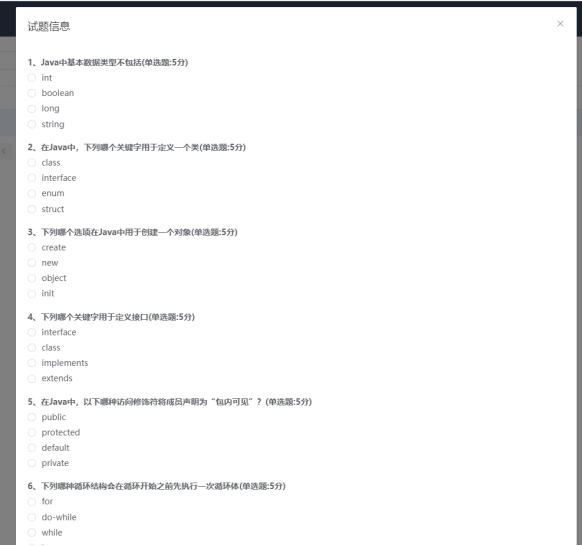

# 1 项目介绍
基于SSM+Vue的在线考试系统：后端 SpringBoot、Mybatis-Plus，前端Vue+ElementUI，具体功能如下：
## 管理端
- 老师管理
- 学生管理
- 班级管理
- 学科管理
## 老师端
- 试题管理
- 试卷管理
- 试卷批改
- 个人中心：查看和修改个人信息
## 学生端
- 在线考试
- 查看考试结果
- 个人中心：查看和修改个人信息
# 2 系统运行截图
## 2.1 用户登录

## 2.2 试题列表

## 2.3 编辑试题

## 2.4 试卷管理

## 2.5 编辑试卷

## 2.6 试卷预览

## 2.7 批改试卷

## 2.8 考试结果

## 2.9 系统文档

# 3 数据库设计

# 4 源码数据库获取(收费)

